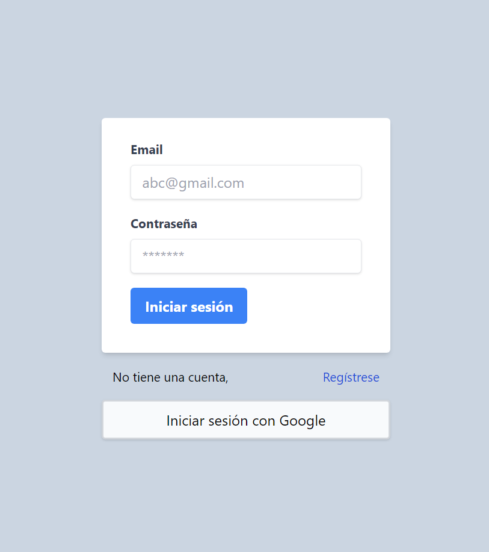

# Login en React con Firebase

## Estructura

- src, es todo el código para la aplicación Backend y Frontend
- docs, carpeta de los screenshots de la aplicación

## Tutorial
- [Youtube Tutorial](https://www.youtube.com/watch?v=H_vEJt5Id_I&t=6693s)
